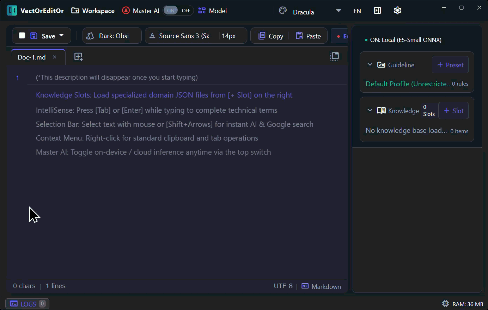

# VectOrEngine (`vect-or-engine`)

> **High-Performance Rust-Powered Vector Indexing (HNSW) & Semantic Validation Engine**

[](LICENSE)
[](https://github.com/1abcdefggs/vect-or-engine/packages)
[](package.json)
[](https://www.rust-lang.org/)
[](https://nodejs.org/)
[](https://napi.rs/)
[](#running-tests)
[-success?style=flat-square)](#-security--audit)
[](#)

**VectOrEngine** is a lightweight, ultra-high-performance native semantic computation engine crafted in Rust. Engineered specifically for next-generation intelligent text editors, IDEs, and local-first AI workspaces, it delivers **sub-millisecond vector similarity search (HNSW + SIMD)**, **real-time schema-driven static linting**, and **zero-copy memory-mapped knowledge management** via direct in-memory Node.js/Electron N-API bindings.

> 💡 **Powering VectOrEditOr**: This engine is actively deployed as the core native backend running directly inside the Electron main process of our flagship text editor, **[VectOrEditOr](https://github.com/1abcdefggs/VectOrEditOr)**, providing zero-latency semantic features with complete local privacy.

> **Engineered for Speed**: Pure Rust core featuring `f16` half-precision quantization, SIMD auto-vectorization, and Rayon multi-threaded scans.  
> **Schema-Driven Validation**: High-throughput document linting and conflict analysis powered by the Aho-Corasick automaton and regular expressions.  
> **Zero-Cost Interoperability**: Direct C-ABI native bindings via `napi-rs`, completely eliminating IPC serialization and network latency.

- **Repository**: [https://github.com/1abcdefggs/vect-or-engine](https://github.com/1abcdefggs/vect-or-engine)
- **Author / Copyright**: Copyright (c) 2026 [@1abcdefggs](https://github.com/1abcdefggs)

<div align="center">
  
</div>

---

## Key Features

- **Hierarchical Navigable Small World (HNSW)**: $O(\log N)$ approximate nearest neighbor cosine similarity search with SIMD auto-vectorization. ($M=16, efConstruction=64, efSearch=32$).
- **SearchQuery Parameter Bundle**: Structured, type-safe query formulation with top-k limits, slot routing, and minimum similarity threshold filtering.
- **Versioned Simple Binary**: Clean `vect-or-engine-v0.3.0.node` naming for unambiguous binary tracking and version matching.
- **Memory-Efficient Representation**:
  - `f16` half-precision float vector quantization (50% RAM reduction).
  - `memmap2` zero-copy memory-mapped I/O for instant multi-gigabyte knowledge loading.
- **Real-Time Multi-Pattern Linter**: Parallel rule evaluation and keyword conflict analysis using Aho-Corasick automaton and regex.
- **Native Node.js Bindings (N-API)**: Direct in-memory bindings via `napi-rs` with non-blocking worker pool execution (`spawn_blocking`).
- **Model Context Protocol (MCP) Server**: Built-in HTTP JSON-RPC daemon on port 4000 for AI agent integration.
- **Pluggable Local Cache**: Bundled SQLite cache backend for fast warm-restarts.

---

## Project Structure

```
vect-or-engine/
├── Cargo.toml          # Rust crate configuration (v0.3.0) & optimization profiles
├── Cargo.lock          # Deterministic Rust dependency lockfile
├── lib.rs              # N-API bindings & Node.js native interface (bridge layer)
├── index.js            # Cross-platform native addon loader
├── index.d.ts          # TypeScript type declarations
├── package.json        # npm package configuration & NAPI metadata (@1abcdefggs/vect-or-engine)
├── LICENSE             # MIT License
├── README.md           # Documentation
├── mcp/
│   └── server.mjs      # Model Context Protocol (MCP) JSON-RPC HTTP server
├── test/
│   ├── test-napi.js    # Node.js N-API integration tests
│   └── test-kb.json    # Minimal test dataset
└── src/
    ├── lib.rs          # Core Rust library crate root
    ├── main.rs         # Stdin/stdout JSON-RPC server binary
    ├── hnsw_index.rs   # HNSW graph indexing & search implementation
    ├── knowledge_store.rs # Vector quantization (f16), mmap, and SQLite store
    ├── validator.rs    # Real-time static linter & rule evaluator
    ├── translator.rs   # Term mapping & colloquial pattern matching
    ├── profile.rs      # Schema-driven profile deserializer
    └── engine_error.rs # Typed engine error definitions
```

---

## Getting Started

### Prerequisites

- [Rust](https://www.rust-lang.org/) (2021 edition, `cargo` v1.75+)
- [Node.js](https://nodejs.org/) (v18+)

### Build Native Addon

```bash
# Install development dependencies
npm install

# Compile release binary (.node)
cargo build --release
```

### Running Tests

```bash
# Run Rust unit & integration tests
cargo test

# Run Node.js N-API binding integration tests
npm test
```

### Start MCP Server (Port 4000)

```bash
npm run start-mcp
```

---

## Installation

```bash
# Via GitHub Packages / npm
npm install @1abcdefggs/vect-or-engine

# Or via GitHub Releases / repository
npm install git+https://github.com/1abcdefggs/vect-or-engine.git#v0.3.0
```

---

## JavaScript / TypeScript API Usage

```typescript
import {
  validateSync,
  loadKnowledgeBase,
  buildIndex,
  search,
  kbInfo
} from '@1abcdefggs/vect-or-engine';

// 1. Real-time document validation (Linter)
const lintResult = validateSync("Target document content...");
console.log(`Valid: ${lintResult.isValid}, Markers: ${lintResult.markers.length}`);

// 2. Load vector dataset and build HNSW index
await loadKnowledgeBase('./knowledge_base.json');
await buildIndex();

// 3. Vector similarity search
const queryVector = new Float32Array([0.12, 0.45, -0.33 /* ... */]);
const results = await search(queryVector, 5); // Top-5 nearest neighbors
```

---

## Security & Audit

VectOrEngine adheres to rigorous enterprise security standards:
- **Zero Supply-Chain Risk**: Pure self-contained Rust native compilation with zero runtime npm package dependencies.
- **Path Traversal Protection**: In-memory path validation preventing directory traversal and null-byte injection.
- **Audit Verified**: Free of hardcoded credentials, secret leaks, and known CVE vulnerabilities.

---

## License

This project is licensed under the [MIT License](LICENSE).  
Copyright (c) 2026 [@1abcdefggs](https://github.com/1abcdefggs).
